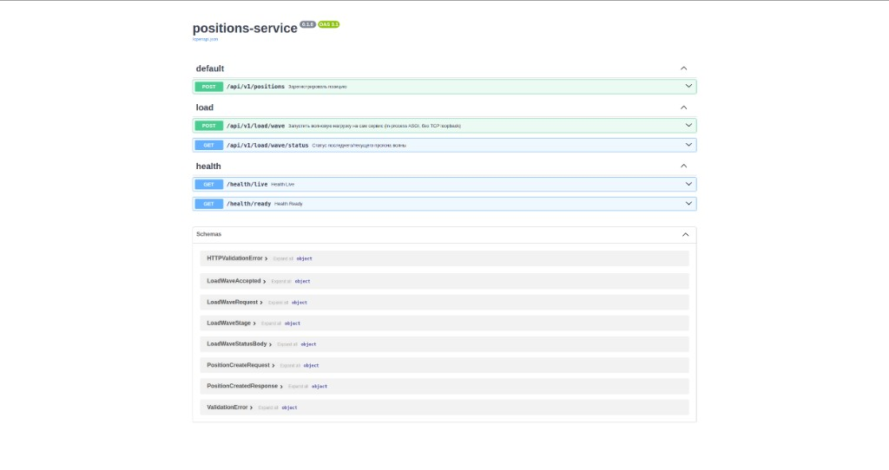
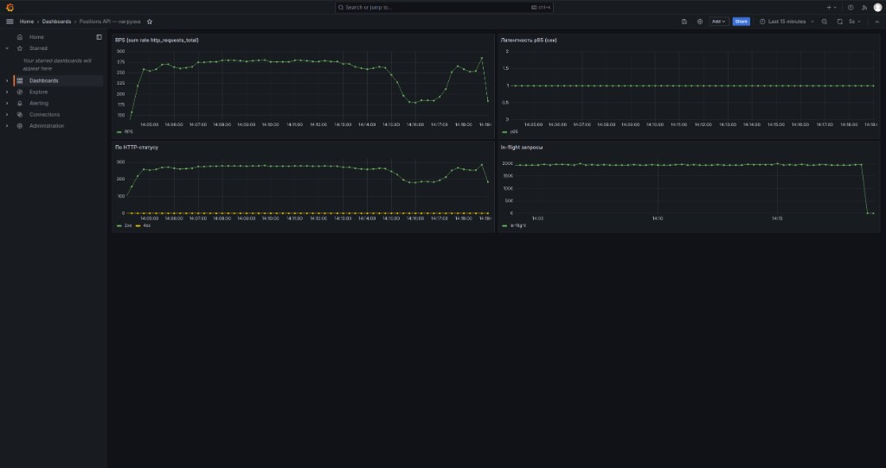
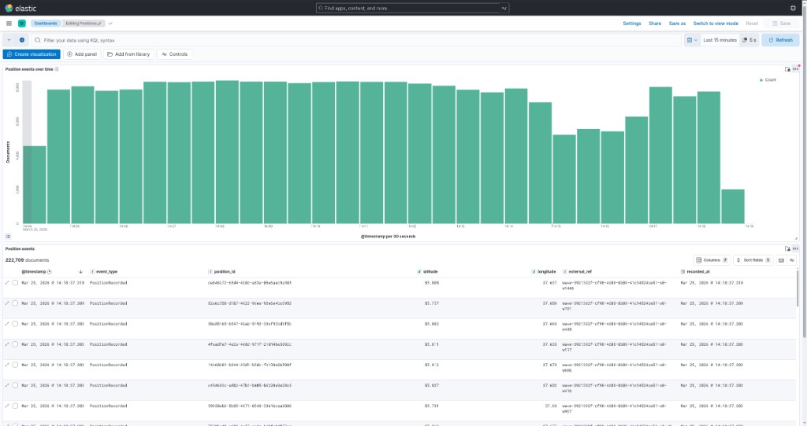

# positions-service

Демо-сервис приёма геокоординат: **PostgreSQL**, **Kafka**, **Prometheus / Grafana**, **ELK**.  
**Python 3.12** · **FastAPI** · DDD-слои · **uv** · **ruff** · **mypy strict**

---

## Стек и границы

| Слой | Технологии |
|------|------------|
| Домен | `Coordinates`, `Position`, `PositionRecorded` — без зависимостей от инфраструктуры |
| Application | `RegisterPositionCommand` / `RegisterPositionHandler`, порты `UnitOfWork`, `DomainEventPublisher` |
| Infrastructure | SQLAlchemy + asyncpg, aiokafka |
| HTTP | `interfaces/http` |

Транзакция БД → `commit` → публикация в Kafka (при откате событие не уходит). Распределённый трейсинг не входит в объём.

**Нагрузка:** ориентир порядка ~3k RPS на выделенном железе со «срезанным» compose; полный стек на одной машине упирается в CPU/RAM. Для бенчмарка имеет смысл оставить `app + postgres + kafka`, затем смотреть метрики в Grafana. Интеграционные тесты в репозитории нет — только unit домена и application.

---

## Endpoints (дефолтные порты из `.env`)

| | |
|--|--|
| API | `http://localhost:8000` — `POST /api/v1/positions`, `/docs`, `/openapi.json` |
| Health | `/health/live`, `/health/ready` |
| Prometheus | `:9090` |
| Grafana | `:3000` (дефолтные учётные данные — в `.env.example`) |
| Kibana | `:5601` — после `kibana-setup` импортируются data view `positions-*` и дашборд **Positions — overview** (гистограмма + таблица; по умолчанию **Last 15 minutes**, автообновление **5 s**): [`/app/dashboards#/view/positions-dashboard`](http://localhost:5601/app/dashboards#/view/positions-dashboard) |

**Kibana / Elasticsearch без строк:** индексы `positions-*` появляются после успешных `POST /api/v1/positions` (событие в Kafka → Logstash → ES). При пустом экране расширьте временной диапазон или нажмите **Refresh**. После `docker compose down -v` данные в ES обнуляются.

---

## Запуск

Только **Docker Compose**. На Linux при необходимости для Elasticsearch:

```bash
sudo sysctl -w vm.max_map_count=262144
```

```bash
docker compose up --build
```

Конфигурация: [`.env.example`](.env.example) → `.env` в корне (опционально). Миграции Alembic — в `docker-entrypoint.sh` при старте `app`.

---

## Нагрузка

Встроенный генератор: `POST /api/v1/load/wave` (ASGI in-process). Включение — `LOAD_GENERATOR_ENABLED` в [`.env.example`](.env.example). Для сопоставимых замеров RPS удобно **`UVICORN_WORKERS=1`**.

| Метод | Путь | Описание |
|-------|------|----------|
| `POST` | `/api/v1/load/wave` | Старт волны; тело опционально (`stages`, `think_time_ms_min` / `max`). Без `stages` — сценарий по умолчанию (~8–9 мин). Ответ `202` + `run_id`. |
| `GET` | `/api/v1/load/wave/status` | Статус прогона. |

```bash
curl -sS -X POST http://localhost:8000/api/v1/load/wave \
  -H "Content-Type: application/json" \
  -d '{}'
curl -sS http://localhost:8000/api/v1/load/wave/status
```

---

## Демонстрация (UI)

OpenAPI 3.1, Grafana (RPS, статусы, p95, in-flight), Kibana (Kafka → Logstash → ES):







---

## Линты и тесты

```bash
uv run ruff check src tests alembic
uv run ruff format --check src tests alembic
uv run mypy src
uv run pytest tests/unit -v
```

Pre-commit: [`.pre-commit-config.yaml`](.pre-commit-config.yaml) — в тон с CI.

```bash
uv sync --all-groups && uv run pre-commit install
uv run pre-commit run --all-files
```

---

## CI

[`.github/workflows/ci.yml`](.github/workflows/ci.yml) — ruff, mypy, pytest, сборка Docker-образа.
